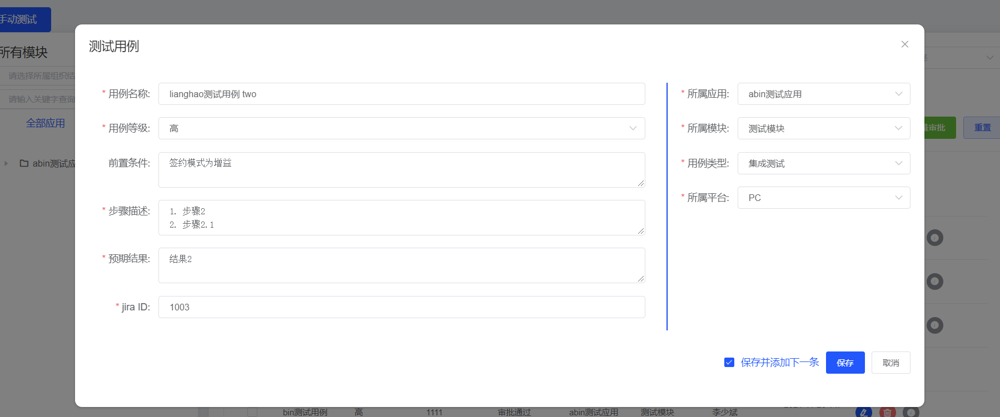
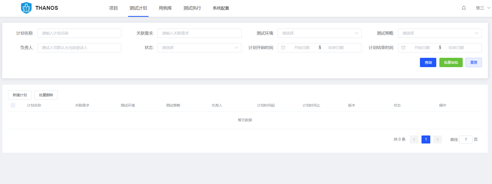

# thanos 软件质量保障平台

## 友情提示
> 1. **快速体验项目**：暂未提供，运行项目请参照下文 [演示版本运行必须完成的事情] 板块，完成准备工作。参照 [项目运行] 模块运行项目。
> 2. **演示版本账号**：管理员账号: zhangsan 密码: 123456
> 3. **前端项目地址**：[thanos-ui](https://github.com/ziroom-oss/thanos-ui)

**现状**

1. 用例管理分散：各类型测试用例分散管理、功能用例管理缺失、移动端测试用例管理缺失

1. 测试和研发割裂：测试用例执行结果和构建、部署版本无中间依赖关系

1. 测试调度割裂：测试环节割裂，没有统一的公共的测试任务调度服务

1. 测试报告线下汇总：测试报告线下汇总抄送相关知悉人员

**目标**

打造一站式质量交付平台，建立自动化、标准化、规范化的测试服务体系，高效组织管理测试工作，保证交付质量，提高测试效率，形成测试流程闭环

1. 高效组织管理测试工作，保证交付质量
2. 覆盖完整测试流程，提高测试效率，形成测试流程闭环

## **功能流程图**


## **项目演示**

支持用例Excel/Xmind导入、批量审批、删除，支持用例在线编辑。

**用例库**

在线创建用例之前需先创建其所属应用及模块/可支持上传excel和xmind



**测试执行**
执行用例模块，需要用例库的测试执行都审核通过


**测试计划**



**项目**
测试执行的聚合，统计所有测试执行的情况，可以发送邮件报表


发送日报邮件的邮件预览/以及发送


**系统设置**


## 演示版本运行必须完成的事情
```lua
├── 数据库 
-- 1. 创建数据库(mysql版本 5.7之后版本 支持多个timestamp)   
-- 2. 执行 根目录下的 数据库.sql 导入数据   
-- 3. 修改 application-dev.properties 数据库配置

```
## 项目运行需要完成的事情
```lua
├── 后端 -- 执行 [演示版本运行必须完成的事情] 后，直接启动即可
├── 前端 
1. npm insall   
2. npm start 具体参照 [传送门](https://github.com/ziroom-oss/thanos-ui/README.md) 中 [搭建步骤] 模块

## 许可证

[Apache License 2.0](LICENSE)
